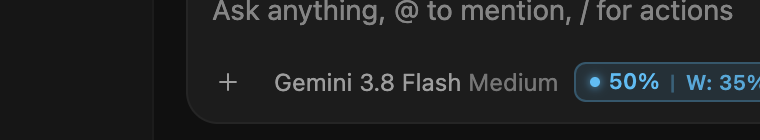

# Antigravity Quota Monitor ⚡️

[](https://opensource.org/licenses/MIT)
[]()
[]()

> A seamless, native, Claude-style real-time quota indicator embedded directly into Google Antigravity's model selector.



---

## ✨ Features

- **Direct In-App Integration**: Embeds a clean, non-intrusive micro-badge inside the model picker (`• 50% | W: 35%`).
- **Dual Tracking**:
  - **Session Quota**: Real-time active 5-hour limit and countdown (`Resets in 30 min`).
  - **Weekly Quota**: 7-day aggregate burn rate indicator (`W: 35%`).
- **Adaptive Dark & Light Theme**: Automatically detects Antigravity's active theme and applies high-contrast, crystal-clear colors for both dark and white interfaces.
- **Update-Proof**: Survives all Antigravity application updates without being wiped, as it runs via user-space background synchronization.
- **Cross-Platform**: Fully supports macOS (LaunchAgent), Linux (systemd user unit), and Windows (Startup task).

---

## 🚀 One-Line Installation

### macOS & Linux
```bash
curl -fsSL https://raw.githubusercontent.com/m4tinbeigi-official/antigravity-quota-monitor/main/install.sh | bash
```

Or clone and install manually:
```bash
git clone https://github.com/m4tinbeigi-official/antigravity-quota-monitor.git
cd antigravity-quota-monitor
chmod +x install.sh
./install.sh
```

### Windows (PowerShell)
```powershell
irm https://raw.githubusercontent.com/m4tinbeigi-official/antigravity-quota-monitor/main/install.ps1 | iex
```

---

## 🛠 How It Works

1. **Native Background Daemon (`sync_daemon.py`)**:
   - Queries Google CloudCode backend periodically (`https://daily-cloudcode-pa.googleapis.com/v1internal:fetchAvailableModels`).
   - Calculates session remaining fractions and weekly aggregated usage.
   - Syncs values into Antigravity's local IPC storage (`app_storage.json`).

2. **Sleek DOM Injector (`antigravity_quota_injector.js`)**:
   - Mounts cleanly into the `[data-testid="model-selector-trigger"]` button.
   - Uses `MutationObserver` to ensure zero flickering across React re-renders.
   - Listens to theme attribute changes to automatically swap between Dark and Light color schemes.

---

## 📄 License

MIT © [Matin Beigi](https://github.com/m4tinbeigi-official)
